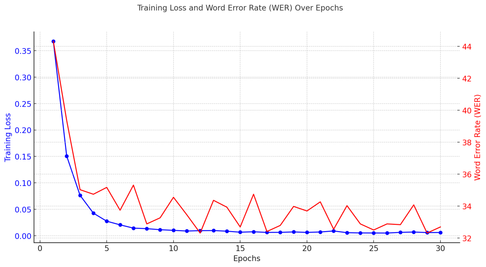
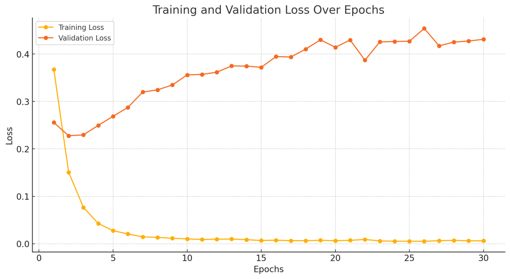

# Nepali Speech to Text Translation (ASR) System

## Introduction
This project aims to build an Automatic Speech Recognition (ASR) system  for the Nepali language. Using OpenAI's Whisper Small model as the base, we fine-tuned it on a custom dataset to accurately transcribe Nepali speech into text. 
## Goals
1. To create a high-quality, open-source ASR system for Nepali speech.
2. To build a user-friendly demo for end-users to test and use the model for various applications.
## Contributors
- **Adhip Bhattarai**
- **Amit Pant**
- **Kshitiz Poudel**  
- **Prabin Sharma Poudel**

## Project Architecture
1. **Data Preparation**: Scripts for cleaning, preprocessing, and augmenting Nepali speech data.
2. **Model Training**: Configuration and scripts for fine-tuning the Whisper model.
3. **Inference and Evaluation**: Tools and demo interfaces to run the model on new audio samples.
4. **Frontend and Deployment**: A Streamlit application for interactive user testing.


# Status
## Known Issue
- Some audio files contain background noise that affects transcription quality.
- Limited data . More data can be used to generalize in different scenarios
- Multiple channels or multiple people talking not transcribed well
## High Level Next Steps
1. Collect more diverse and high-quality Nepali speech data.
2. Train larger models if gpu resources available


# Usage
## Installation
Use git clone.

Install the requirements with  

`pip install -r requirements.in`

## Usage Instructions
### GUI Inference
1) clone the repository
- `git clone https://github.com/fuseai-fellowship/Nepali-Speech-to-Text-Translation.git`
2) change to inference directory
- `cd src/inference`
3) run
- `streamlit run app.py`

### CLI Inference
 `python src/inference.py test.mp3`


# Data Source
Refere to the [dataset readme](./dataset/README.md) for details on the dataset, sources, usablility and the link to data.

## Code Structure

```python 

## Updated Code Structure

├── assets
├── dataset
│   ├── male-female-data (SLR143)
│   ├── ne_np_female (SLR43)
│   ├── preperation_scripts
│   ├── scraping
│   ├── synthetic_data_using_TTS
│   └── README.md
├── docs
├── notebook
│   ├── finetuning-whispher-on-Nepali-base_old_data.ipynb
│   ├── finetuning-whispher-on-Nepali-small_old_data.ipynb
│   ├── notebook_inference_and_push_hub.ipynb
│   ├── whisper_fine_tune_5_epoch.ipynb
│   └── whispher-finetune-on-small_NP_ASR_data.ipynb
├── src
│   ├── inference
│   ├── inference.py
│   ├── test.mp3
│   ├── train.py
│   └── utils.py
├── tests
│   └── test_template.py
├── Dockerfile
├── Makefile
├── pyproject.toml
├── README.md
├── requirements.in
├── requirements.txt

```

datasets: Data preparation scripts.
src: Model training and architecture
src/utils: utility functions for processing audio and model output
src/inference: Inference scripts and the Streamlit demo.
requirements.in: List of Python dependencies.

Makefile: Commands to set up and manage the project.
## Artifacts Location
 - HuggingFace Demo: https://huggingface.co/spaces/kshitizzzzzzz/NEPALI_ASR_Whisper_Small
 - Model source code: https://github.com/huggingface/transformers/blob/main/src/transformers/models/whisper/modeling_whisper.py

# Results



## Metrics Used
We used the Word Error Rate (WER) to evaluate the accuracy of the ASR system. WER is calculated as follows:

$$ \text{WER} = \frac{\text{Substitutions} + \text{Insertions} + \text{Deletions}}{\text{Total Words}} $$

A lower WER indicates a better-performing model.


## Evaluation Results
The current model has WER of 32 on common voice and other collected validation set.
